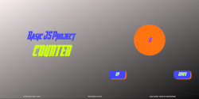

<h1>Counter</h1>

This project is the exam of the "Javascript-Basic" course of the <a href="https://start2impact.it">Start2Impact</a> University

<h3>Technologies:</h3>
<ul>
    <li>Javascript</li>
    <li>Html</li>
    <li>Scss</li>
</ul>
<h3>Requirements</h3>

Develop a Javascript application that has two buttons that allow the user to increase or decrease a visible counter.

Both user actions and counter value changes must be implemented with Javascript.

<h3>Description</h3>

I added some small effects on the counter element when a user increases or decreases his level by clicking the "up" or "down" button.

Furthermore I have implemented a new element, the reset button, which allows the user to reset the counter value to zero, this button is only visible if the counter value is different from zero

 

See my counter implementation

<h3>Author</h3>

<a href="https://github.com/GianfrancoMan">Gianfranco Manca</a>

